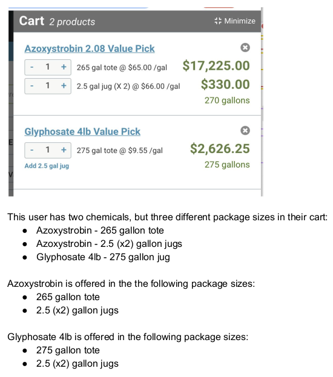

# _VinSolution_

#### _Version 1_
#### _Date 02/12/2021_
#### By _**Adilet Momunaliev**_

##Description
_The Task
Given a mockup of an ecommerce shopping cart, and a javascript object representing
what a user has in their shopping cart, transform the javascript object into an
intermediate shape that can be more easily transformed into HTML._
_Details
Farmers Business Network has an ecommerce platform where users can shop for
chemicals for their farm. This is a screenshot of a cart._

## Getting Started

These instructions will get you a copy of the project up and running on your local machine for development and testing purposes.

### Instruction

* Node js in your local machine
* git clone
* npm install
* npm run start
### Specifications
  ;

### License

*_Copyright (c) 2021 **Adilet Momunaliev**_*
